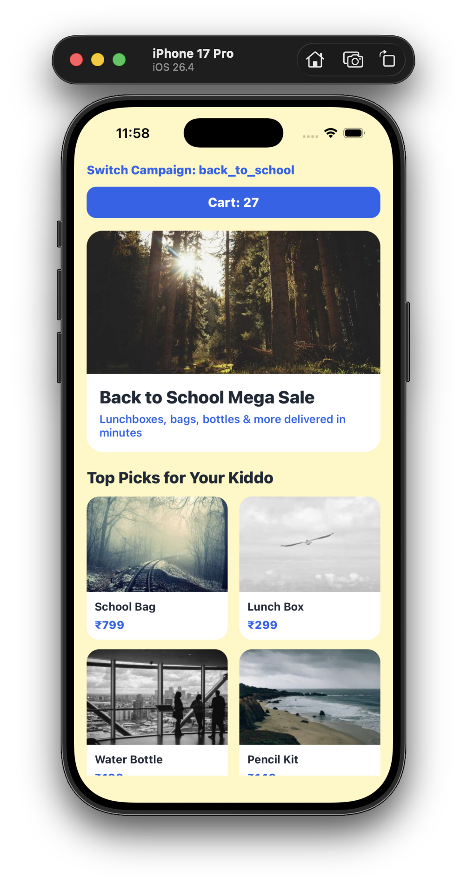
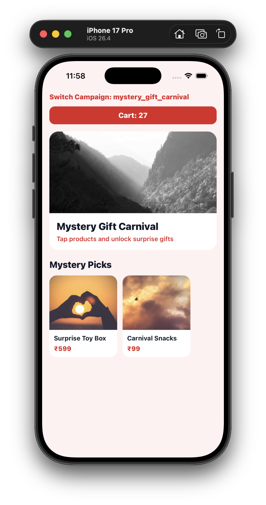
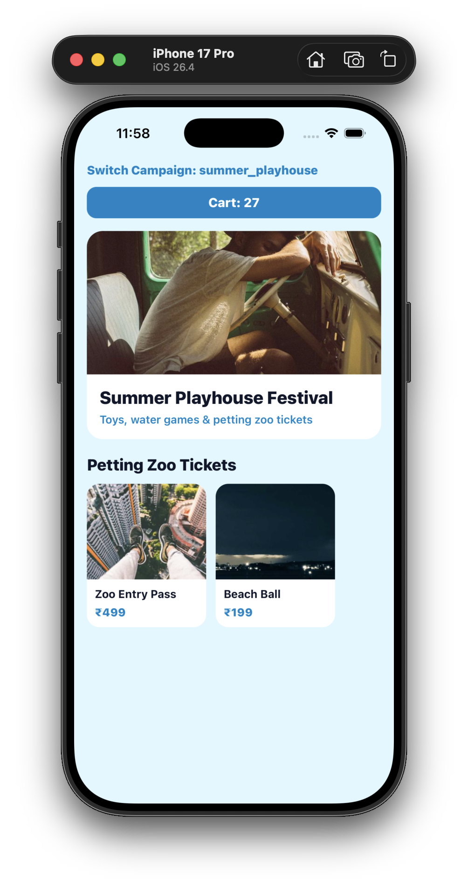
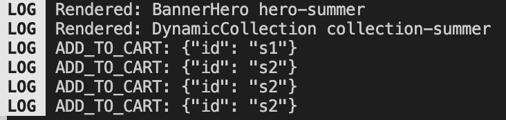

# Kiddo SDUI Assignment

An Expo-powered React Native assignment that demonstrates a Server-Driven UI
(SDUI) homepage renderer for the Kiddo mobile app.

The app consumes a dynamic JSON payload and renders heterogeneous homepage
blocks through a scalable component registry. The implementation focuses on
runtime theming, campaign switching, action dispatching, rendering isolation,
and safe handling of malformed or unknown payload blocks.

## Table of Contents

- [Screenshots](#screenshots)
- [Tech Stack](#tech-stack)
- [Quick Start](#quick-start)
- [Architecture](#architecture)
- [Supported Blocks](#supported-blocks)
- [Actions](#actions)
- [Campaigns](#campaigns)
- [Project Structure](#project-structure)
- [Performance Notes](#performance-notes)
- [Assumptions](#assumptions)
- [Future Improvements](#future-improvements)
- [Author](#author)

## Screenshots

### Home Screen



### Campaign Switching



### Cart Update



### Logs



## Tech Stack

- **Expo SDK 56** with React Native `0.85.3`
- **React 19**
- **TypeScript** in strict mode
- **FlashList** for performant list virtualization
- **Zustand** for isolated cart state
- **React Context API** for runtime theme injection
- **Lottie React Native** for campaign overlays

## Quick Start

Install dependencies:

```bash
npm install
```

Start the Expo development server:

```bash
npm start
```

Run on Android:

```bash
npm run android
```

Run on iOS:

```bash
npm run ios
```

Run on web:

```bash
npm run web
```

## Architecture

### Server-Driven UI Flow

The homepage is fully driven by a local mock backend payload.

```text
Backend Payload
  -> SDUI Renderer
  -> Component Registry
  -> React Native Components
```

### Component Registry Pattern

The renderer maps payload block types to React Native components through a
registry instead of relying on large switch statements.

```ts
export const componentRegistry = {
  BANNER_HERO: BannerHero,
  PRODUCT_GRID_2X2: ProductGrid2x2,
  DYNAMIC_COLLECTION: DynamicCollection,
  FULL_SCREEN_OVERLAY: FullScreenOverlay,
};
```

This keeps the SDUI layer:

- Easy to extend with new block types
- Simple to maintain as the payload grows
- Open to runtime component mapping
- Resilient when unknown block types arrive

### Runtime Theme Injection

Themes are supplied by the payload and injected into the app with React Context.

```json
{
  "theme": {
    "primary": "#FF9933",
    "background": "#FFF5E6",
    "text": "#1F2937",
    "card": "#FFFFFF"
  }
}
```

This allows campaign-level visual changes without requiring a new app release.

### Overlay Architecture

Overlay blocks are extracted from the main feed and rendered above the
application layer.

```tsx
pointerEvents="none"
```

This allows full-screen campaign effects to appear without interfering with
scrolling or blocking user interactions.

## Supported Blocks

The current SDUI renderer supports:

- `BANNER_HERO`
- `PRODUCT_GRID_2X2`
- `DYNAMIC_COLLECTION`
- `FULL_SCREEN_OVERLAY`

Unknown component types are safely ignored so the rest of the homepage can
continue rendering.

## Actions

All user interactions are routed through a centralized action dispatcher.

Supported actions:

- `ADD_TO_CART`
- `DEEP_LINK`
- `APPLY_MYSTERY_GIFT_COUPON`

The UI components stay presentation-focused. They dispatch actions, while
business behavior stays inside the dispatcher.

## Campaigns

The project includes three mock campaign configurations:

1. **Back To School**
2. **Summer Playhouse**
3. **Mystery Gift Carnival**

Campaign switching dynamically updates:

- Theme colors
- Homepage content
- Overlay configuration
- Campaign-specific actions

## State Management

Zustand manages cart state independently from the homepage feed rendering
pipeline.

This prevents unnecessary re-renders of:

- Banner blocks
- Product grids
- Dynamic collections
- Overlay components

## Payload Validation

Runtime type guards validate payload blocks before they are rendered.

Invalid or malformed blocks are discarded safely, preserving the remaining view
hierarchy and keeping the app stable.

## Project Structure

```text
src/
├── actions/        # Central action dispatcher
├── components/     # SDUI block components and shared UI
├── data/           # Mock homepage payloads
├── engine/         # Renderer, registry, and block guards
├── store/          # Zustand stores
├── theme/          # Runtime theme context
└── types/          # SDUI payload and action types
```

## Performance Notes

The implementation uses:

- FlashList virtualization
- `React.memo` boundaries
- Stable key extractors
- `useMemo` for derived render data
- `useCallback` for stable handlers
- Overlay separation from feed rendering
- Zustand selector-based subscriptions

## Assumptions

- Backend payloads are mocked locally.
- Remote media URLs are mocked with placeholder URLs.
- Deep link actions are logged for demonstration purposes.
- Campaign animation assets are represented with local Lottie files.

## Future Improvements

- Fetch payloads from a remote backend
- Add an action registry pattern
- Introduce a cached media layer
- Add analytics instrumentation
- Support dynamic component registration from remote modules

## Author

**Jitanshu Kushwaha**  
Senior React Native Developer
